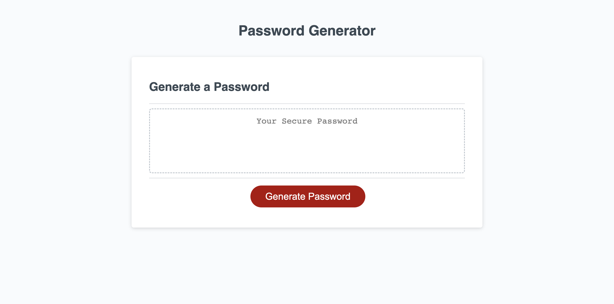

# On Screen Interactive Password Generator

## Description
In our daily activities online, we come across pages where we are required to signup with username and password. One of the dangers of this is compromization of passwords over time. It is very essential that such information is kept secreet but that is a hard task. Setting up websites where the user gets a new password token generated verey single visit will ameliorate password compromises. To make it accessible, on screen approaches are ideal.

## Acceptance Criteria
The following acceptance criteria was addopted from https://git.bootcampcontent.com/University-of-Toronto/UTOR-VIRT-FSF-PT-05-2023-U-LOLC/-/tree/main/03-JavaScript/02-Challenge
```
GIVEN I need a new, secure password
WHEN I click the button to generate a password
THEN I am presented with a series of prompts for password criteria
WHEN prompted for password criteria
THEN I select which criteria to include in the password
WHEN prompted for the length of the password
THEN I choose a length of at least 8 characters and no more than 128 characters
WHEN asked for character types to include in the password
THEN I confirm whether or not to include lowercase, uppercase, numeric, and/or special characters
WHEN I answer each prompt
THEN my input should be validated and at least one character type should be selected
WHEN all prompts are answered
THEN a password is generated that matches the selected criteria
WHEN the password is generated
THEN the password is either displayed in an alert or written to the page
```

## Method
Starter codes for index.html, style.css and script.js were provided by Sean Roshan. The script.js file was editted to ensure that above acceptance criteria were met. Various funtions were created and are shown in the attached link for github below.

The github repository can be found at https://github.com/StanOp09/Password_generator

The live website is hosted at https://stanop09.github.io/Password_generator/Develop

## Appearance and Functionality


## Credits
Sean Roshan

ChatGPT
